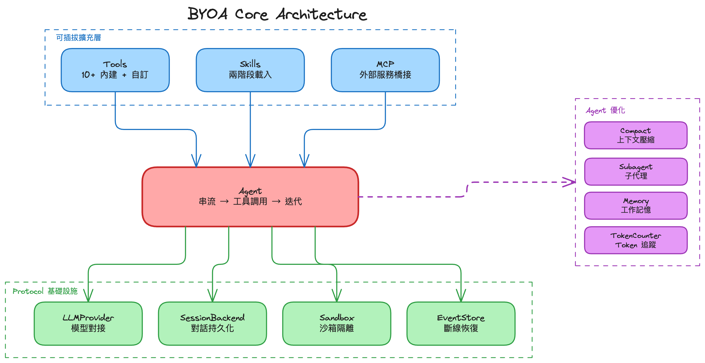

+++
date = '2026-02-16T15:00:00+08:00'
draft = false
title = '為什麼還想自己造一個 AI Agent'
categories = ["AI", "Tutorial"]
tags = ["Agent", "AI", "BYOA", "AI x 人共同寫作"]
series = ["Bring Your Own Agent"]
+++

## 契機

2025 的 DevOpsDays，在 [安德魯架構師](https://columns.chicken-house.net/) 演講的結尾時，他提到一句話，大意是：身為軟體工程師，你應該要知道像 Cursor 這類的 coding agent 是怎麼做的。

當時的我的確對於這類技術只有使用的經驗，但是卻沒有真的了解背後的機制，加上其實工作上的確不需要自己建立 agent，所以就默默地放置。

年底時參加了 webconf，在整理筆記時看到 [iHower](https://ihower.tw/blog/) 的簡報中有提到，你應該要嘗試自己建立一個 agent 看看。

三番兩次的被提點，再加上科技變化如此之快：MCP、Skills 等新技術不斷出現。面對這些不斷出現的新名詞，但自己卻好像連最基礎的 agent 原理都沒有深入了解過，因此決定**以學習的角度**出發，來嘗試自己做一個 agent。

## 在 AI 時代，為什麼還要自己做？

現在 Claude Code、Cursor、Codex，能寫程式的強力 Agent 滿天飛。什麼都有了，為什麼還要自己建？

前面提到了，原本的初心是要用學習的角度出發，所以一開始是參考 [Geoffrey Huntley 的文章)](https://ghuntley.com/agent/)，打算就依照文中的架構做一個 python 版的 coding agent。

但真的做下去，開始思考整個 agent 的運作流程之後，才發現原來有那麼多細節可以探討。並且開始思考平常自己使用最多的 Claude Code 是怎麼做的，或是去看 claude 官方的 [部落格](https://www.anthropic.com/engineering) 的相關文章。**與其說是要做一個產品，更精確地來說是在做產品的過程中去搞懂它**。

## 用產品的心態在做

出發點確實不是要建一個生產級的產品，但因為現在不論是開發多小的東西都習慣了使用 BDD 的思維出發 (之後的文章會更詳細的介紹)。所以用了做產品的心態在開發它，而用這樣的角度去開發時，自然就會開始思考很多不同面向的題：

- **它好不好？** — 改了一版 prompt，到底是變好還是變差？在大張旗鼓的建立可觀測性系統前，我應該要注意什麼指標？
- **它可以更好嗎？** — 畢竟是在燒自己的錢，當然會希望能在燒比較少錢的情形下，還能維持一定程度的品質。這就可以帶到 `prompt catching`、`memory` 與 `compact` 等優化概念
- **它能做更多嗎？** — 內建的工具不夠用了，要怎麼擴充？有沒有標準化的方式讓別人的工具也能接進來？現有的設計足夠有彈性卻不失章法嗎？
- **其他輪子 (競品) 都怎麼做？** — 有些時候直接參考其他人的設計，也許會比自己埋頭苦幹還要好。像我在 sandbox 的設計的確苦惱了非常久，雖然在 [Nanoclaw](https://github.com/qwibitai/nanoclaw/tree/main) 上有獲得啟發，但還是根據自己專案的情形做了調整

這四個問題，就是推動這整個系列的引擎。雖然出發點不是為了要做產品，但是透過這樣的心態去開發，對我來說反而學習到了更多。有時候我們在一些學習的案例上，很常就只是點到為止，卻沒有好好去探索**未來**會發生的事情，這種某種程度上屬於**過度開發**的心態，我覺得在這個旅途上不一定是壞事

## 開發時的輔助工具

當然前面提到了 BDD ，所以當然是把 TDD 也用上了，並且也搭配 pyright strict mode 以及 ruff 的配置等等，以及搭配 sonarqube 做最小限度的 code review，其中配置是參考 [kyomind 大大的這篇](https://blog.kyomind.tw/weamind-ci/)。之前的確沒有用這樣的規格去開發過，所以在 pyright 採了一些坑，但總體來說有了這些安全護欄，讓我搭配 AI 開發時可以不用擔心專案失控或是長成無法維護的怪獸。

## 這個系列在記錄什麼

很多東西的確在這個時代問 AI 是最快的選擇，但對我來說這也是我自己搞懂這些東西的過程紀錄。每一篇對應一個我在建造過程中碰到的問題：

| 第幾篇 | 我學到了什麼 |
|---|---|
| 第一篇 | Agent 的本質 — 迴圈、通訊、工具呼叫，以及這些協議之間的差異 |
| 第二篇 | 怎麼讓它跑得更好 — Prompt Cache、Context 壓縮、記憶、斷線重連 |
| 第三篇 | 怎麼擴充它 — MCP 工具協議、Skill 知識注入 |
| 第四篇 | 怎麼知道它行不行 — 根據自己的任務設計 Eval |
| 第五篇 | 怎麼在高速迭代中不翻車 — BDD、TDD、型別檢查、Linting |

第一篇從最基礎的開始：Agent 到底是什麼？它的核心迴圈長什麼樣？為什麼需要 SSE？Tool Use 的協議怎麼運作？

第二篇開始處理「能跑」之後遇到的問題：token 越來越貴、context 越來越長、對話斷了怎麼接回來。

第三篇講擴充：當內建工具不夠用，要怎麼透過 MCP 接入外部工具？怎麼用 Skill 注入領域知識？

第四篇講評估：你怎麼知道你的 Agent 變好了？自己設計 Eval 來量化。

第五篇拉高一層來看整個開發流程：用 AI 幫你寫程式的時代，怎麼用 BDD、TDD 和自動化工具鏈維持品質？

## 專案相關資源

Github: https://github.com/class83108/Bring-Your-Own-Agent

PYPI: https://pypi.org/project/byoa-core/

架構圖: 