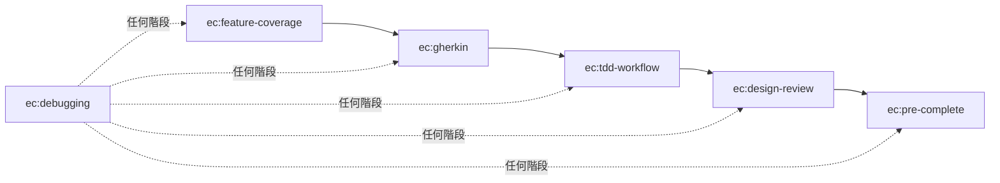

+++
date = '2026-03-19T12:00:00+08:00'
draft = false
title = '從開發流程的斷裂到 Claude Code Skills — spec-to-quality 的由來'
categories = ["AI", "Software Engineering"]
tags = ["Claude Code", "TDD", "Gherkin", "Skills", "AI x 人共同寫作"]
+++

這篇會從比較長的背景開始講起，交代這個 skill 為什麼會出現。如果你只想看 skill 本身在幹嘛，可以直接跳到 [spec-to-quality 在做什麼](#spec-to-quality-在做什麼)。

## 菜鳥時期：AI 就是拿來解問題的

在 AI 工具剛出現的時候（ChatGPT 那陣子），對於 AI 的應用還是著重在**某個功能要怎麼生出來**。

當時的公司沒有 code review 文化，也沒有資深工程師的指導，剛轉職入行的我只會覺得：喔～AI 好像能夠給我解決問題的思路。畢竟那時候幻覺很多，最後實作內容還是要估狗，但至少多了一個可以問的對象。沒有測試先行，沒有評估，沒有重構——能跑就好。

## 開始感覺到不對勁

隨著我要負責的內容越來越重要，我卻不能穩定交付出不容易犯錯的程式碼，或是容易在一些細節上生出跟需求有差異的東西。我開始在想怎麼把事情做好。雖然嘗試著寫一些測試，但缺乏對測試的核心概念，寫出來的測試很多時候說不定其實只需要靠個 Pydantic 還做得更好。

同時因為工作範疇也跟著改變，我要負責的對象不再只有我原本的主管（有工程師背景），還包含了其他非技術背景的主管，或是更高階、不會那麼有時間跟你對接技術怎麼實踐的人。這時候很容易遇到的問題是**我們沒有共通語言**——他說的是某某流程，也許我當下提出的技術看似可以解決該流程，但因為我們都對彼此的話沒有全盤的認知，當下覺得沒問題，做到一半驗收時雙方才發現**原來你是這個意思**。

這段期間最煩惱的事情可以歸納成兩件：

1. **如何穩定交付高品質的程式碼**
2. **如何與需求端真的對齊？**

當然事後回來看會發現有很多不需要 AI 就能很好解決的問題，但那時候的我的確還是把目光聚焦在解決某項問題的技術本身，所以只在意用的技術是不是夠新或是夠主流。甚至當時的我只知道開發上不太順利，但無法歸納出最核心的這兩個問題。

## 認識 TDD 跟 Gherkin

但我覺得蠻幸運的是，因為 AI 爆炸性的成長，在需要快速生產力的這時候，我反而更能花心力去想要怎麼才能好好把關 AI 大量生成的內容。參與各種研討會（DevOpsDays、WebConf 等等），還有多看 [kyomind](https://blog.kyomind.tw/about/) 的文章——他之前的文章介紹蠻多制定規範的工具，我覺得算是這方面我的啟蒙老師。

那也不得不提到 SDD（Spec-Driven Development）這時候開始大量充斥在各個角落，這也讓我認識了我覺得影響我這段時間開發最大的兩個詞：**TDD** 與 **Gherkin**。

先說 [Gherkin](https://cucumber.io/docs/gherkin/)，在認識到它的當下我覺得我終於找到與非技術背景的人之間的共通語言了。尤其只專注在 event storming 這件事上，也更聚焦在專案的行為本身而不是技術本身。雖然後面有發現沒有那麼美好，但晚點再提。

再來是 TDD（Test-Driven Development），就是上面提到的由行為出發——需求端想看的結果。有這層概念以後，就覺得寫測試不再那麼難了，並且測試能確保程式碼與行為一致這件事也變得更加具體。

## 新的問題又來了

但還是在這時候又開始遇到一些問題。

首先是 **Gherkin 到底要寫多細？** 老實說如果直接跳過最全局觀的文檔開始寫 Gherkin，很容易太發散，或是寫太多細節導致 `.feature` 檔根本沒人要看。至於 Gherkin 與測試程式碼之間要一比一這件事，後來有發現 pytest-bdd 這個工具可以做到所以就不多提了。

更大的問題是，直接跟 agent 聊天開始寫 Gherkin 時，因為初始文檔可能有太多技術細節需要腦補，如果是我自己也很缺乏經驗的需求開發，我也很容易漏掉 edge case，然後又是等手動驗收時才會發現有問題。又或者是這樣的流程下來，**Gherkin 太多太細**連我自己都漏掉某些需求，**導致整個流程節點到節點之間可能會有資訊的丟失**，很難第一時間就注意到。

而我覺得某方面 [OpenSpec](https://kaochenlong.com/openspec) 可以解決我這個痛點。它可以根據我們最粗糙的初始文檔，由淺入深地好好擴展，把需求轉成技術實踐的同時又不會遺漏掉我覺得相對重要的地方。並且靠著它，我的 Gherkin 就可以更專注負責在特定等級的寫法，可以更好的跟 pytest-bdd 搭配成真的一比一的 feature 與測項。

## 工具都有了，然後呢

既然現在每個節點需要的工具都有了——從文檔端的 OpenSpec、到行為規格的 Gherkin + pytest-bdd、到實際把關程式碼的 ruff 和 pyright 等等都有了——那剩下的就是如何讓 AI agent 每次都按照這個流程開發。

於是就有了這個 skill。

## spec-to-quality 在做什麼

核心概念很單純：把我的開發流程拆成 6 個 Claude Code skill，用前置條件串起來，強制按順序走。

| Skill | 做什麼 |
|-------|--------|
| **ec:feature-coverage** | 寫 `.feature` 之前，強制對 6 類 scenario 逐一分析，避免漏掉情境 |
| **ec:gherkin** | 照著覆蓋率分析的結果寫 `.feature`，遵循 Feature / Rule / Scenario 結構 |
| **ec:tdd-workflow** | 嚴格的 Red → Green → Refactor，紅燈沒確認不能開始寫 code |
| **ec:design-review** | 綠燈之後的設計審查，用提問方式引導思考，不是直接叫你改 |
| **ec:debugging** | 遇到 bug 先收集證據、建假說、驗證，不准猜著改 |
| **ec:pre-complete** | 要說「完成」之前，跑完測試 + lint + type check，拿到實際輸出才算數 |

跟把規則全部寫在 `CLAUDE.md` 裡不同的地方在於，skill 是**在特定時機被完整載入的指令集**。`CLAUDE.md` 是全域背景知識，在比較長的 context 裡容易被蓋過去；skill 則是在你觸發對應的 slash command 時，整份 instructions 才會注入到當下的 context，確保該階段的規則不會被忽略。

而前置條件的設計讓流程不是靠 agent「記得」要做什麼，而是在結構上強制：沒做完覆蓋率分析就不能寫 `.feature`，TDD 沒綠燈就不能做 design review。

## 這不是最好的工具

這個 skill 一定有更適合你的其他選擇，或是在每個階段都有更深入、思考更全面的其他 skill，甚至是其他 CI 工具也說不定。它就相當於是我把我平日開發流程的過程去嘗試更自動化一點，但我也沒有想要 100% 全自動化——畢竟我覺得我還沒有厲害到能不看程式碼，或是只看一些指標就有全局觀、掌握 codebase 的程度。

這個 skill 相當於是我對軟體開發流程的寫照，但才剛寫出來，沒做多少次完整的 feature 到 code 的開發，單看 skill 感覺跟我的中心思想差異不大。只是一定會跟著我開發方式的改變也跟著一起迭代。

當然不知道 skill 這個概念會不會很快又被迭代掉呢 XD

GitHub repo：[class83108/spec-to-quality](https://github.com/class83108/spec-to-quality)
